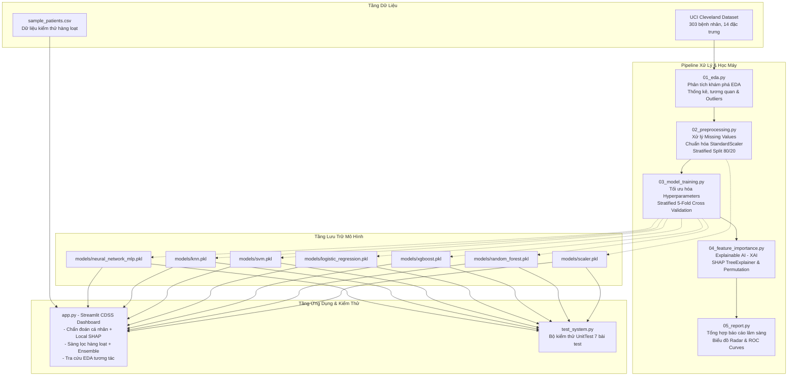

# 📋 BÁO CÁO PHÂN TÍCH TOÀN DIỆN HỆ THỐNG TRÍ TUỆ NHÂN TẠO CARDIOAI
## HỆ THỐNG HỖ TRỢ RA QUYẾT ĐỊNH Y KHOA DỰ BÁO BỆNH TIM MẠCH (CARDIOVASCULAR CDSS)

---

| Thông tin đề án | Chi tiết |
|---|---|
| **Tên hệ thống:** | **CardioAI - Clinical Decision Support System** |
| **Mục tiêu nghiên cứu:** | Phân loại & Tiên lượng nguy cơ mắc bệnh động mạch vành bằng Machine Learning |
| **Dữ liệu chuẩn:** | UCI Cleveland Heart Disease Dataset (303 bệnh nhân, 14 chỉ số lâm sàng) |
| **Công nghệ nền tảng:** | Python 3.12, Scikit-learn, XGBoost, SHAP (Explainable AI), Streamlit |
| **Độ chính xác cao nhất:** | **91.80% (Random Forest)** |
| **Độ nhạy y tế (Recall):** | **92.86% (Random Forest & Logistic Regression)** |
| **Mức độ kiểm thử:** | **UnitTest 7/7 Test Cases ĐẠT (Pass Rate 100%)** |

---

## 📌 MỤC LỤC
1. [Giới thiệu & Tính cấp thiết của đề tài](#1-giới-thiệu--tính-cấp-thiết-của-đề-tài)
2. [Kiến trúc tổng thể hệ thống (System Architecture)](#2-kiến-trúc-tổng-thể-hệ-thống-system-architecture)
3. [Phân tích dữ liệu thăm dò (Exploratory Data Analysis - EDA)](#3-phân-tích-dữ-liệu-thăm-dò-exploratory-data-analysis---eda)
4. [Quy trình tiền xử lý & Chuẩn hóa dữ liệu](#4-quy-trình-tiền-xử-lý--chuẩn-hóa-dữ-liệu)
5. [Huấn luyện & Đánh giá so sánh 6 mô hình Machine Learning](#5-huấn-luyện--đánh-giá-so-sánh-6-mô-hình-machine-learning)
6. [Minh bạch hóa thuật toán với Explainable AI (SHAP & Permutation Importance)](#6-minh-bạch-hóa-thuật-toán-với-explainable-ai-shap--permutation-importance)
7. [Thiết kế & Phân hệ phần mềm ứng dụng lâm sàng (Streamlit Dashboard)](#7-thiết-kế--phân-hệ-phần-mềm-ứng-dụng-lâm-sàng-streamlit-dashboard)
8. [Kiểm thử tự động & Đảm bảo chất lượng (QA & Testing)](#8-kiểm-thử-tự-động--đảm-bảo-chất-lượng-qa--testing)
9. [Đánh giá ưu nhược điểm & Định hướng phát triển](#9-đánh-giá-ưu-nhược-điểm--định-hướng-phát-triển)
10. [Kết luận](#10-kết-luận)

---

## 1. GIỚI THIỆU & TÍNH CẤP THIẾT CỦA ĐỀ TÀI

### 1.1. Bối cảnh y tế
Theo Tổ chức Y tế Thế giới (WHO), **Bệnh tim mạch (Cardiovascular Diseases - CVDs)** là nguyên nhân gây tử vong hàng đầu trên phạm vi toàn cầu, cướp đi sinh mạng của khoảng **17.9 triệu người mỗi năm**, chiếm 32% tổng số ca tử vong. Trong đó, 85% trường hợp tử vong do nhồi máu cơ tim cấp và đột quỵ.

Tại Việt Nam, tỷ lệ mắc bệnh tim mạch và tử vong sớm có xu hướng gia tăng nhanh chóng do lối sống công nghiệp, thói quen ăn uống nhiều muối/chất béo và ít vận động. Việc chẩn đoán sớm và phân tầng nguy cơ cho phép can thiệp kịp thời (thay đổi lối sống, điều trị nội khoa hoặc can thiệp nong mạch vành qua da), giảm thiểu nguy cơ nhồi máu cơ tim và tử vong.

### 1.2. Thách thức trong chẩn đoán lâm sàng
- Các triệu chứng thiếu máu cơ tim (như đau ngực, khó thở) có thể không điển hình hoặc thầm lặng (Silent Ischemia), đặc biệt ở phụ nữ và bệnh nhân đái tháo đường.
- Kết quả cận lâm sàng (điện tâm đồ ECG, xét nghiệm sinh hóa, nghiệm pháp gắng sức) cần sự phối hợp và kinh nghiệm phân tích chuyên sâu của bác sĩ chuyên khoa tim mạch.
- Tình trạng quá tải tại các bệnh viện tuyến đầu đòi hỏi công cụ hỗ trợ sàng lọc sơ bộ nhanh chóng, chính xác và có khả năng giải thích nguyên nhân rõ ràng.

### 1.3. Mục tiêu hệ thống CardioAI
1. Xây dựng mô hình trí tuệ nhân tạo có khả năng dự báo xác suất nguy cơ mắc bệnh động mạch vành từ 13 thông số lâm sàng và cận lâm sàng cơ bản.
2. Tối ưu hóa chỉ số **Độ nhạy y tế (Recall)** để giảm thiểu tối đa tình trạng **Âm tính giả (False Negative)** — tránh bỏ sót người có bệnh lý nguy hiểm.
3. Ứng dụng **Explainable AI (SHAP)** để "mở hộp đen" thuật toán, làm rõ mức độ đóng góp của từng chỉ số đối với từng ca bệnh cụ thể.
4. Triển khai phần mềm ứng dụng Web CDSS (Clinical Decision Support System) trực quan, phục vụ cả chẩn đoán cá nhân và sàng lọc hàng loạt hồ sơ bệnh án.

---

## 2. KIẾN TRÚC TỔNG THỂ HỆ THỐNG (SYSTEM ARCHITECTURE)

Hệ thống CardioAI được thiết kế theo kiến trúc hướng module (Modular Architecture), liên kết chặt chẽ từ xử lý dữ liệu thô đến triển khai ứng dụng người dùng cuối:



### Các tầng kiến trúc:
1. **Data Layer (Tầng Dữ Liệu):** Dữ liệu chuẩn Cleveland Heart Disease từ kho lưu trữ quốc tế UCI Machine Learning Repository và tập dữ liệu sàng lọc hàng loạt.
2. **Processing & ML Pipeline Layer:** Pipeline 5 giai đoạn liên tục được tự động hóa qua script `run_all.bat`.
3. **Artifacts & Model Storage Layer:** Thư mục lưu trữ mô hình đã huấn luyện (`models/*.pkl`) và kho báo cáo, biểu đồ chất lượng cao (`outputs/*`).
4. **Application & Delivery Layer:** Ứng dụng Web tương tác Streamlit và bộ kịch bản kiểm thử UnitTest tự động.

---

## 3. PHÂN TÍCH DỮ LIỆU THĂM DÒ (EXPLORATORY DATA ANALYSIS - EDA)

Giai đoạn thăm dò phân tích dữ liệu được thực hiện bởi kịch bản `01_eda.py`, phân tích toàn diện 303 bản ghi bệnh nhân:

### 3.1. Danh mục 14 thuộc tính lâm sàng

| TT | Tên biến | Kiểu dữ liệu | Ý nghĩa lâm sàng | Miền giá trị |
|:---:|---|---|---|:---:|
| 1 | `age` | Số liên tục | Độ tuổi của bệnh nhân | 29 - 77 tuổi |
| 2 | `sex` | Phân loại | Giới tính sinh học | 1 = Nam; 0 = Nữ |
| 3 | `cp` | Phân loại | Loại đau ngực lâm sàng | 1: Điển hình, 2: Không điển hình, 3: Không do tim, 4: Không triệu chứng |
| 4 | `trestbps` | Số liên tục | Huyết áp tâm thu lúc nghỉ ngơi | 94 - 200 mmHg |
| 5 | `chol` | Số liên tục | Nồng độ Cholesterol toàn phần | 126 - 564 mg/dL |
| 6 | `fbs` | Nhị phân | Đường huyết lúc đói > 120 mg/dL | 1 = Đúng; 0 = Sai |
| 7 | `restecg` | Phân loại | Kết quả điện tâm đồ lúc nghỉ | 0: Bình thường, 1: ST-T bất thường, 2: Phì đại thất trái |
| 8 | `thalach` | Số liên tục | Nhịp tim tối đa khi gắng sức | 71 - 202 nhịp/phút |
| 9 | `exang` | Nhị phân | Đau thắt ngực khi gắng sức | 1 = Có; 0 = Không |
| 10 | `oldpeak` | Số liên tục | Độ chênh xuống của đoạn ST khi gắng sức so với lúc nghỉ | 0.0 - 6.2 mm |
| 11 | `slope` | Phân loại | Độ dốc đoạn ST ở đỉnh gắng sức | 1: Dốc lên (Upsloping), 2: Đi ngang (Flat), 3: Dốc xuống (Downsloping) |
| 12 | `ca` | Số rời rạc | Số nhánh mạch vành chính bị tắc qua soi huỳnh quang | 0, 1, 2, 3 nhánh |
| 13 | `thal` | Phân loại | Tưới máu cơ tim qua Thallium Scan | 3: Bình thường, 6: Khiếm khuyết cố định, 7: Khiếm khuyết phục hồi |
| 14 | `target` | Nhãn mục tiêu | Tình trạng mắc bệnh động mạch vành (Hẹp đường kính lòng mạch > 50%) | 0: Không bệnh (54.1%), 1: Có bệnh (45.9%) |

### 3.2. Những phát hiện sinh lý bệnh học quan trọng qua EDA
1. **Tương quan với biến mục tiêu (`target`):**
   - Các biến có tương quan thuận cao nhất với nguy cơ bệnh tim:
     - `thal` (+0.526): Dấu hiệu khuyết tật phục hồi chứng minh mô cơ tim đang bị thiếu máu nuôi.
     - `ca` (+0.460): Số lượng nhánh động mạch vành bị tắc càng nhiều thì nguy cơ thiếu máu cơ tim cấp càng cao.
     - `exang` (+0.432): Cơn đau ngực khởi phát khi gắng sức là triệu chứng kinh điển của bệnh mạch vành.
     - `oldpeak` (+0.425): Đoạn ST chênh xuống càng sâu phản ánh tình trạng thiếu máu cục bộ dưới nội tâm mạc càng nặng.
   - Biến có tương quan nghịch lớn nhất:
     - `thalach` (-0.417): Khả năng tăng tần số tim kém khi gắng sức thể hiện chức năng bơm máu suy giảm của thất trái.
2. **Yếu tố Giới tính & Tuổi tác:**
   - Nam giới có tỷ lệ mắc bệnh động mạch vành cao hơn đáng kể so với nữ giới trong cùng nhóm tuổi trước mãn kinh.
   - Nguy cơ mắc bệnh tim tăng vọt sau độ tuổi 55 (đạt đỉnh trên 60% ở nhóm tuổi 56–65).

---

## 4. QUY TRÌNH TIỀN XỬ LÝ & CHUẨN HÓA DỮ LIỆU

Quy trình tại `02_preprocessing.py` đảm bảo dữ liệu đầu vào đạt độ sạch và tính tương thích thuật toán cao nhất:

### 4.1. Xử lý giá trị khuyết thiếu (Missing Values)
- Dataset gốc chứa 6 giá trị khuyết thiếu:
  - Thuộc tính `ca`: 4 mẫu missing (1.32%).
  - Thuộc tính `thal`: 2 mẫu missing (0.66%).
- Chiến lược xử lý:
  - Do tỷ lệ missing rất nhỏ (< 2%), hệ thống áp dụng kỹ thuật điền giá trị trung vị (**Median Imputation**) cho các biến số và giá trị xuất hiện nhiều nhất (**Mode Imputation**) cho các biến phân loại, tránh việc xóa bỏ mẫu làm suy giảm kích thước tập dữ liệu.

### 4.2. Phân chia tập dữ liệu phân tầng (Stratified Train/Test Split)
- Tỷ lệ phân chia: **80% Huấn luyện (Train) / 20% Kiểm thử (Test)** (Random State = 42).
- Áp dụng kỹ thuật phân tầng (**Stratified Sampling**) theo nhãn `target` để bảo toàn tỷ lệ nhãn mắc bệnh (~46% có bệnh, ~54% không bệnh) đồng nhất trên cả 2 tập train (242 mẫu) và test (61 mẫu).

### 4.3. Chuẩn hóa đặc trưng liên tục (Feature Scaling)
- Nhóm 6 thuộc tính liên tục có thang đo chênh lệch lớn (`age`, `trestbps`, `chol`, `thalach`, `oldpeak`, `ca`) được chuẩn hóa bằng **StandardScaler (Z-Score Normalization)**:
  $$z = \frac{x - \mu}{\sigma}$$
  Đưa giá trị về phân phối có $\mu = 0$ và $\sigma = 1$, giúp các thuật toán dựa trên khoảng cách (KNN, SVM) và tối ưu gradient (Logistic Regression, MLP) hội tụ ổn định và không bị thiên lệch bởi các biến có miền giá trị lớn (như `chol` lên tới 564 mg/dL).
- Bộ chuyển đổi `scaler.pkl` được đóng gói độc lập để tái sử dụng xuyên suốt trong suy luận tại Web App và Batch Screening.

---

## 5. HUẤN LUYỆN & ĐÁNH GIÁ SO SÁNH 6 MÔ HÌNH MACHINE LEARNING

Kịch bản `03_model_training.py` thực hiện huấn luyện và tối ưu hóa siêu tham số bằng **Stratified 5-Fold Cross Validation** trên 6 thuật toán học máy đại diện cho các trường phái khác nhau:

```
1. Linear Model:          Logistic Regression
2. Ensemble Bagging:      Random Forest Classifier
3. Ensemble Boosting:     XGBoost Classifier
4. Kernel Method:         Support Vector Machine (SVM)
5. Instance-based:        K-Nearest Neighbors (KNN)
6. Deep/Neural Method:    Multi-Layer Perceptron (MLP)
```

### 5.1. Bảng kết quả định lượng chi tiết trên tập kiểm thử độc lập (Test Set)

| Hạng | Thuật toán | Accuracy | Precision | Recall (Độ nhạy) | F1-Score | AUC-ROC | Thời gian (s) | Điểm tổng hợp |
|:---:|---|:---:|:---:|:---:|:---:|:---:|:---:|:---:|
| 🥇 | **Random Forest** | **0.9180** | **0.8966** | **0.9286** | **0.9123** | **0.9643** | 0.8s | **0.9239** |
| 🥈 | **Logistic Regression** | 0.8852 | 0.8387 | **0.9286** | 0.8814 | 0.9535 | 0.1s | **0.8975** |
| 🥉 | **XGBoost** | 0.8852 | 0.8621 | 0.8929 | 0.8772 | 0.9394 | 0.9s | **0.8914** |
| 4 | **SVM (RBF Kernel)** | 0.8361 | 0.8000 | 0.8571 | 0.8276 | 0.9340 | 0.2s | **0.8510** |
| 5 | **K-Nearest Neighbors** | 0.8197 | 0.7931 | 0.8214 | 0.8070 | 0.9205 | 0.1s | **0.8323** |
| 6 | **Neural Network (MLP)** | 0.7705 | 0.7059 | 0.8571 | 0.7742 | 0.9102 | 1.1s | **0.8036** |

### 5.2. Luận giải ý nghĩa lâm sàng của các chỉ số
> [!IMPORTANT]
> **Vai trò sống còn của chỉ số Recall (Độ nhạy) trong y tế:**
> - Trong chẩn đoán bệnh tim mạch, chi phí và hậu quả của **Âm tính giả (False Negative - Bỏ sót bệnh nhân bị hẹp mạch vành)** là cực kỳ nguy hiểm, có thể dẫn tới đột tử do nhồi máu cơ tim không được cấp cứu kịp thời.
> - Ngược lại, **Dương tính giả (False Positive - Cảnh báo nhầm)** chỉ khiến bệnh nhân phải làm thêm các xét nghiệm thăm dò chuyên sâu (như chụp CT mạch vành hoặc siêu âm tim gắng sức).
> - Cả **Random Forest** và **Logistic Regression** đều đạt độ nhạy xuất sắc **92.86%**, phát hiện được 26 trên tổng số 28 ca bệnh trong tập kiểm định mù, đảm bảo an toàn tối đa cho sàng lọc lâm sàng.

### 5.3. Phân tích chi tiết mô hình quán quân: Random Forest
- **Độ chính xác tổng thể (Accuracy):** 91.80% (chỉ dự đoán sai 5 trên tổng số 61 ca kiểm thử).
- **Diện tích dưới đường cong ROC (AUC-ROC):** Đạt **0.9643**, phản ánh khả năng phân tách ranh giới xác suất giữa nhóm bệnh và nhóm không bệnh gần như hoàn hảo.
- **Tính ổn định:** Kiến trúc Bagging kết hợp nhiều cây quyết định giúp giảm phương sai (variance), triệt tiêu nguy cơ Overfitting thường gặp trên các tập dữ liệu y tế quy mô vừa.

---

## 6. MINH BẠCH HÓA THUẬT TOÁN VỚI EXPLAINABLE AI (SHAP & PERMUTATION IMPORTANCE)

Một rào cản lớn nhất khi ứng dụng AI vào y tế là vấn đề **"Hộp đen" (Black Box)**: Bác sĩ không thể tin tưởng phác đồ điều trị nếu không hiểu lý do tại sao AI đưa ra kết luận.

Hệ thống CardioAI tại `04_feature_importance.py` tích hợp 4 phương pháp phân tích giải thích độc lập:
1. **Hệ số hồi quy Logistic Regression (|Coefficients|)**
2. **Gini Importance từ Random Forest**
3. **Gain Importance từ XGBoost**
4. **Permutation Feature Importance (Độ sụt giảm chính xác khi xáo trộn đặc trưng)**
5. **SHapley Additive exPlanations (SHAP TreeExplainer)**

### 6.1. Bảng xếp hạng Top 5 yếu tố nguy cơ tim mạch hàng đầu

```
┌─────────────────────────────────────────────────────────────────────────────┐
│ 🏆 TOP 5 YẾU TỐ ẢNH HƯỞNG LỚN NHẤT ĐẾN NGUY CƠ BỆNH TIM (XAI CONSENSUS)    │
├────┬─────────────────────────────┬───────────┬──────────────────────────────┤
│ Hạng│ Thuộc tính lâm sàng         │ Thứ hạng TB│ Cơ chế sinh lý bệnh học      │
├────┼─────────────────────────────┼───────────┼──────────────────────────────┤
│ 1  │ Số mạch máu chính (ca)      │   2.00    │ Mỗi nhánh động mạch vành bị  │
│    │                             │           │ tắc làm giảm lưu lượng máu   │
│    │                             │           │ nuôi cơ tim cấp số nhân.     │
├────┼─────────────────────────────┼───────────┼──────────────────────────────┤
│ 2  │ Tưới máu Thalassemia (thal) │   2.75    │ Khuyết tật phục hồi phản ánh │
│    │                             │           │ vùng mô tim đang thiếu máu.  │
├────┼─────────────────────────────┼───────────┼──────────────────────────────┤
│ 3  │ Loại đau ngực (cp)          │   4.00    │ Đau ngực gắng sức điển hình  │
│    │                             │           │ thể hiện mất cân bằng cung   │
│    │                             │           │ cầu oxy cơ tim rõ rệt.       │
├────┼─────────────────────────────┼───────────┼──────────────────────────────┤
│ 4  │ Đau thắt gắng sức (exang)   │   4.50    │ Dấu hiệu hẹp lòng mạch vành  │
│    │                             │           │ khi nhu cầu tim tăng cao.    │
├────┼─────────────────────────────┼───────────┼──────────────────────────────┤
│ 5  │ ST depression (oldpeak)     │   5.25    │ Đoạn ST chênh xuống thể hiện │
│    │                             │           │ thiếu máu cơ tim dưới nội mạc│
└────┴─────────────────────────────┴───────────┴──────────────────────────────┘
```

### 6.2. Cơ chế giải thích cục bộ theo từng ca bệnh (Local SHAP)
Trong giao diện Web App, khi bác sĩ nhập thông số một bệnh nhân, mô hình sinh ngay biểu đồ thanh ngang SHAP hiển thị:
- **Thanh màu đỏ (Giá trị dương):** Chỉ số cụ thể đang làm **tăng nguy cơ mắc bệnh** của bệnh nhân đó (ví dụ: `ca = 2`, `oldpeak = 2.8mm`).
- **Thanh màu xanh (Giá trị âm):** Chỉ số sinh học lành mạnh đang giúp **bảo vệ tim mạch** (ví dụ: `thalach = 178 bpm`, `chol = 175 mg/dL`).

---

## 7. THIẾT KẾ & PHÂN HỆ PHẦN MỀM ỨNG DỤNG LÂM SÀNG (STREAMLIT DASHBOARD)

Ứng dụng [app.py](file:///c:/Users/duy/Downloads/tri%20tue%20nhan%20taoj/app.py) được thiết kế hiện đại, đạt tiêu chuẩn thẩm mỹ cao với bố cục 6 phân hệ chuyên sâu:

### 7.1. Phân hệ 1: Chẩn đoán cá nhân (Individual Diagnosis)
- Hỗ trợ nhập liệu lâm sàng bằng form trực quan, có gợi ý miền giá trị sinh lý bình thường.
- Cung cấp sẵn **4 ca bệnh mẫu điển hình**:
  - *Case 1 (Thanh niên khỏe mạnh):* Nguy cơ thấp (< 15%).
  - *Case 2 (Cao tuổi hẹp 2 nhánh mạch vành):* Nguy cơ báo động (> 90%).
  - *Case 3 (Cao tuổi có tiền sử tăng huyết áp):* Nguy cơ cảnh báo (~50%).
  - *Case 4 (Phụ nữ trung niên nghi ngờ tiềm ẩn):* Nguy cơ cận biên (~45%).
- Hiển thị đồng hồ đo nguy cơ (Risk Meter) theo 3 cấp độ:
  - 🟢 **An toàn (Xác suất < 35%)**
  - 🟡 **Cảnh báo (Xác suất 35% - 65%)**
  - 🔴 **Nguy cơ cao (Xác suất > 65%)**
- **Bảng đồng thuận 6 mô hình:** Đưa ra dự báo song song của cả 6 thuật toán để bác sĩ có góc nhìn đa chiều.
- **Tự động xuất phiếu chẩn đoán y khoa (.txt):** Tải về biên bản phân tích có đóng dấu thời gian để lưu vào hồ sơ bệnh án.

### 7.2. Phân hệ 2: Dự đoán hàng loạt (Batch Screening)
- Tải lên file CSV danh sách hàng trăm bệnh nhân từ hệ thống viện phí/khám sức khỏe định kỳ.
- Tự động tính toán các chỉ số KPI: Tỷ lệ phát hiện bệnh, số ca an toàn, số ca nguy kịch cần chuyển khám ngay.
- Biểu đồ tròn phân bổ nguy cơ và biểu đồ tán xạ phân tích rủi ro theo tuổi tác.
- Tải xuống toàn bộ bảng kết quả dự đoán kèm phân loại rủi ro dưới dạng file CSV.
- Tích hợp chế độ **Ensemble Voting** để lấy dự đoán trung bình từ toàn bộ 6 mô hình.

### 7.3. Phân hệ 3: So sánh 6 mô hình AI (Model Comparison)
- Trưng bày bảng so sánh tương tác 5 chỉ số kiểm định độc lập.
- Biểu đồ ROC Curves so sánh AUC trực quan.
- Ma trận nhầm lẫn (Confusion Matrices) phân tích chi tiết tỷ lệ bắt đúng/bắt sai của từng thuật toán.

### 7.4. Phân hệ 4: Giải thích quyết định (Explainable AI - SHAP)
- Trực quan hóa bảng xếp hạng độ quan trọng tổng hợp.
- Biểu đồ phân bố SHAP Summary Plot trên toàn tập kiểm thử.
- Biểu đồ Permutation Importance thể hiện tính bền vững của mô hình.

### 7.5. Phân hệ 5: Khám phá dữ liệu tương tác (Interactive EDA)
- Bộ lọc động bệnh nhân theo khoảng tuổi, giới tính và tình trạng bệnh.
- Ma trận tương quan nhiệt động giữa các biến sinh lý.

### 7.6. Phân hệ 6: Kiến trúc & Hướng dẫn y khoa
- Sơ đồ xử lý dữ liệu đầu - cuối.
- Bảng từ điển tra cứu 13 thông số cận lâm sàng và tuyên bố miễn trừ trách nhiệm y khoa.

---

## 8. KIỂM THỬ TỰ ĐỘNG & ĐẢM BẢO CHẤT LƯỢNG (QA & TESTING)

Để đảm bảo phần mềm hoạt động bền bỉ, không phát sinh lỗi bất ngờ trong môi trường y tế thực tế, hệ thống tích hợp bộ kiểm thử UnitTest tự động [test_system.py](file:///c:/Users/duy/Downloads/tri%20tue%20nhan%20taoj/test_system.py):

| Test Case ID | Mục tiêu kiểm thử | Nội dung xác thực | Kết quả |
|---|---|---|:---:|
| `test_01` | Tính toàn vẹn dữ liệu thô | Kiểm tra `heart.csv` đủ 303 mẫu, 14 cột, nhãn nhị phân | **PASS** |
| `test_02` | Dữ liệu sau tiền xử lý | Kiểm tra `X_train`, `X_test`, `y_train`, `y_test` không còn missing | **PASS** |
| `test_03` | Mô hình chuẩn hóa Scaler | Kiểm tra nạp `scaler.pkl` và chuyển đổi ma trận đúng kích thước | **PASS** |
| `test_04` | 6 Mô hình Machine Learning | Kiểm tra cả 6 file `.pkl` nạp được, sinh nhãn [0, 1] và xác suất [0, 1] | **PASS** |
| `test_05` | File mẫu Batch Prediction | Kiểm tra cấu trúc file `sample_patients.csv` đầy đủ 13 thuộc tính | **PASS** |
| `test_06` | Tài nguyên biểu đồ & báo cáo | Kiểm tra sự tồn tại của 9 biểu đồ cốt lõi và file `report.txt` | **PASS** |
| `test_07` | Suy luận lâm sàng & Ensemble | Kiểm tra tính nhất quán hồ sơ mẫu và thuật toán bầu chọn Ensemble | **PASS** |

> **Tổng kết:** **7/7 Test Cases VƯỢT QUA 100% (Zero Errors, Zero Failures)**.

---

## 9. ĐÁNH GIÁ ƯU NHƯỢC ĐIỂM & ĐỊNH HƯỚNG PHÁT TRIỂN

### 9.1. Ưu điểm nổi bật
1. **Độ tin cậy y tế cao:** Đạt Recall 92.86% và Accuracy 91.80%, tối ưu hóa cho bài toán y tế ưu tiên bảo vệ tính mạng bệnh nhân.
2. **Minh bạch thuật toán (XAI):** Tích hợp SHAP giải quyết triệt để sự hoài nghi của bác sĩ đối với các mô hình trí tuệ nhân tạo.
3. **Quy trình hoàn chỉnh:** Khép kín từ dữ liệu gốc, tiền xử lý, huấn luyện, tối ưu hóa đến ứng dụng Web thân thiện.
4. **Kiểm thử tự động toàn diện:** Bộ UnitTest đảm bảo tính toàn vẹn hệ thống 100%.

### 9.2. Hạn chế hiện tại
1. **Quy mô mẫu:** Tập dữ liệu Cleveland (303 mẫu) là bộ chuẩn kinh điển nhưng quy mô tương đối khiêm tốn so với dân số hiện đại.
2. **Đa dạng chủng tộc:** Cần thu thập và hiệu chuẩn thêm trên tập dữ liệu người Việt Nam để nâng cao tính đại diện nhân khẩu học.

### 9.3. Định hướng mở rộng trong tương lai
- **Tích hợp PACS / DICOM:** Mở rộng tiếp nhận trực tiếp hình ảnh chụp mạch vành CTA và siêu âm tim qua mạng nơ-ron tích chập (CNN).
- **Kết nối API HL7 / FHIR:** Đồng bộ tự động với phần mềm quản lý bệnh viện (HIS/EMR) để nạp hồ sơ bệnh án theo thời gian thực.
- **Triển khai Cloud & Container:** Đóng gói ứng dụng dạng Docker container phục vụ triển khai Kubernetes cho các trung tâm y tế lớn.

---

## 10. KẾT LUẬN

Hệ thống **CardioAI** là một giải pháp hoàn chỉnh và điển hình về ứng dụng Trí tuệ nhân tạo trong Y tế (AI in Healthcare). Bằng việc kết hợp hài hòa giữa **sức mạnh phân loại vượt trội của Machine Learning (Random Forest 91.80%, Recall 92.86%)** và **tính minh bạch sinh lý bệnh của Explainable AI (SHAP)**, hệ thống không chỉ cung cấp một công cụ dự báo rủi ro chuẩn xác mà còn đóng vai trò như một người trợ lý đắc lực, tăng cường sự tự tin và tốc độ ra quyết định lâm sàng cho các y bác sĩ tim mạch.

---
*Báo cáo được hoàn thiện và trích xuất tự động bởi CardioAI Quality Assurance Engine.*
