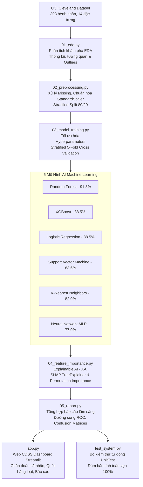

# ❤️ CardioAI - Hệ Thống Trí Tuệ Nhân Tạo Dự Báo & Hỗ Trợ Chẩn Đoán Bệnh Tim Mạch

[](https://share.streamlit.io/deploy?repository=20233327-ux/tr-tu-nh-n-t-o-&branch=main&mainModule=app.py)
[](https://www.python.org/)
[](https://scikit-learn.org/)
[](https://xgboost.ai/)
[](https://shap.readthedocs.io/)
[](LICENSE)


> **Hệ thống Hỗ trợ Ra Quyết định Y khoa (Clinical Decision Support System - CDSS)** ứng dụng Machine Learning để phân loại nguy cơ bệnh lý mạch vành từ các chỉ số lâm sàng và cận lâm sàng, tích hợp **Explainable AI (SHAP)** nhằm minh bạch hóa quyết định chẩn đoán.

---

## 📌 1. TỔNG QUAN HỆ THỐNG

Bệnh tim mạch (CVDs) là nguyên nhân gây tử vong hàng đầu toàn cầu (theo WHO, chiếm ~17.9 triệu ca mỗi năm). Việc phát hiện sớm nguy cơ thiếu máu cơ tim và bệnh động mạch vành đóng vai trò sinh tử trong điều trị can thiệp kịp thời.

**CardioAI** xây dựng một quy trình hoàn chỉnh từ dữ liệu thô đến hệ thống phần mềm ứng dụng lâm sàng:
- **Dữ liệu huấn luyện:** Tập dữ liệu chuẩn quốc tế **UCI Cleveland Heart Disease** (303 bệnh nhân, 14 biến lâm sàng).
- **Học máy đa mô hình:** Huấn luyện, tối ưu hóa siêu tham số (Hyperparameter Tuning với Stratified 5-Fold Cross Validation) trên **6 thuật toán Machine Learning**.
- **Mô hình tốt nhất:** **Random Forest** đạt độ chính xác **91.80%**, F1-Score **0.9123**, AUC-ROC **0.9643**.
- **Độ nhạy y tế (Recall):** **Logistic Regression** và **Random Forest** đạt **92.86%**, giúp giảm thiểu tối đa tình trạng âm tính giả (bỏ sót bệnh nhân nguy kịch).
- **Minh bạch thuật toán (XAI):** Sử dụng **SHAP (SHapley Additive exPlanations)** và **Permutation Importance** để bác sĩ hiểu rõ tại sao mô hình đưa ra kết luận.
- **Ứng dụng thực tế:** Giao diện Web **Streamlit Dashboard** chuyên nghiệp hỗ trợ cả chẩn đoán từng ca lẫn quét hàng loạt hồ sơ bệnh viện (Batch Screening).

---

## 🏗️ 2. KIẾN TRÚC HỆ THỐNG (SYSTEM ARCHITECTURE)



---

## 📊 3. BẢNG SO SÁNH KẾT QUẢ 6 MÔ HÌNH MACHINE LEARNING

| Hạng | Thuật toán (Model) | Accuracy | Precision | Recall (Độ nhạy) | F1-Score | AUC-ROC | Thời gian (s) | Đánh giá |
|:---:|---|:---:|:---:|:---:|:---:|:---:|:---:|---|
| 🥇 | **Random Forest** | **0.9180** | **0.8966** | **0.9286** | **0.9123** | **0.9643** | 0.8s | **Tốt nhất tổng thể (Khuyên dùng)** |
| 🥈 | **Logistic Regression** | 0.8852 | 0.8387 | **0.9286** | 0.8814 | 0.9535 | 0.1s | **Recall cao nhất (Phù hợp sàng lọc)** |
| 🥉 | **XGBoost** | 0.8852 | 0.8621 | 0.8929 | 0.8772 | 0.9394 | 0.9s | Cân bằng cao, suy luận nhanh |
| 4 | **Support Vector Machine (SVM)** | 0.8361 | 0.8000 | 0.8571 | 0.8276 | 0.9340 | 0.2s | Khả năng tổng quát hóa ổn định |
| 5 | **K-Nearest Neighbors (KNN)** | 0.8197 | 0.7931 | 0.8214 | 0.8070 | 0.9205 | 0.1s | Dựa trên khoảng cách không gian |
| 6 | **Neural Network (MLP)** | 0.7705 | 0.7059 | 0.8571 | 0.7742 | 0.9102 | 1.1s | Mạng nơ-ron đa tầng |

> 💡 **Ý nghĩa Lâm sàng:** Trong y tế, chỉ số **Recall (Độ nhạy)** giữ vai trò tối quan trọng nhằm hạn chế tối đa **Âm tính giả (False Negative - Bỏ sót bệnh nhân)**. Cả **Logistic Regression** và **Random Forest** đều đạt Recall xuất sắc **92.86%**.

---

## 🔍 4. TOP 5 YẾU TỐ ẢNH HƯỞNG LỚN NHẤT ĐẾN BỆNH TIM (XAI)

Dựa trên phân tích kết hợp giữa **SHAP TreeExplainer**, **Random Forest Gini**, **XGBoost Gain** và **Permutation Importance**:

1. **`ca` (Số mạch máu chính bị tắc):** Yếu tố tiên lượng mạnh nhất. Mỗi nhánh động mạch vành bị hẹp làm tăng cấp số nhân nguy cơ nhồi máu cơ tim cấp.
2. **`cp` (Loại đau ngực):** Cơn đau thắt ngực gắng sức điển hình (Typical Angina) phản ánh tình trạng cung - cầu oxy cơ tim bị mất cân bằng nghiêm trọng.
3. **`oldpeak` (ST depression khi gắng sức):** Đoạn ST chênh xuống càng sâu (mm) thì mức độ thiếu máu cục bộ cơ tim càng trầm trọng.
4. **`thalach` (Nhịp tim tối đa):** Khả năng tăng tần số tim kém khi gắng sức thể hiện suy giảm chức năng bơm máu thất trái.
5. **`thal` (Tưới máu cơ tim Thalassemia):** Dấu hiệu khuyết tật phục hồi phản ánh vùng mô cơ tim đang bị thiếu máu nuôi dưỡng.

---

## 🖥️ 5. GIAO DIỆN WEB ỨNG DỤNG LÂM SÀNG (STREAMLIT APP)

Ứng dụng **`app.py`** cung cấp 6 phân hệ chuyên sâu:

1. **🩺 Chẩn đoán Cá nhân:**
   - 4 hồ sơ bệnh nhân mẫu kiểm thử nhanh (Khỏe mạnh, Nguy cơ cao, Trung bình, Không điển hình).
   - Tùy chọn 6 mô hình AI hoặc chế độ **Ensemble Voting** (đồng thuận đa mô hình).
   - Đồng hồ đo mức độ nguy cơ (An toàn < 30%, Cảnh báo 30-65%, Nguy cơ cao > 65%).
   - Bảng phân tích đóng góp từng chỉ số với **Local SHAP**.
   - Kế hoạch chăm sóc lâm sàng & nút xuất **Phiếu báo cáo chẩn đoán**.
2. **📁 Dự đoán Hàng loạt (Batch Screening):**
   - Tải lên file CSV danh sách nhiều bệnh nhân hoặc dùng bộ dữ liệu mẫu (10 ca có sẵn).
   - Tính toán KPI tỷ lệ phát hiện, biểu đồ phân bổ nguy cơ và tải kết quả dạng CSV.
3. **📊 So sánh 6 Mô hình AI:**
   - Bảng so sánh 7 chỉ số kiểm định, biểu đồ ROC curves và ma trận nhầm lẫn (Confusion Matrices).
4. **🔍 Giải thích Quyết định (SHAP & XAI):**
   - Phân tích cơ chế sinh lý bệnh và biểu đồ xếp hạng độ quan trọng của biến.
5. **📈 Khám phá Dữ liệu (EDA Explorer):**
   - Bộ lọc bệnh nhân theo độ tuổi, giới tính, tình trạng bệnh; ma trận tương quan nhiệt.
6. **ℹ️ Hướng dẫn & Kiến trúc:**
   - Sơ đồ xử lý, bảng tra cứu 13 thông số và khuyến cáo y khoa.

---

## 🚀 6. HƯỚNG DẪN CÀI ĐẶT & SỬ DỤNG

### Bước 1: Cài đặt thư viện phụ thuộc
```bash
pip install -r requirements.txt
```

### Bước 2: Huấn luyện toàn bộ hệ thống & Chạy kiểm thử tự động
Chỉ cần chạy file kịch bản batch tự động:
```bat
run_all.bat
```
Hoặc thực thi từng bước bằng lệnh Python:
```bash
python 01_eda.py              # Phase 1: Phân tích khám phá dữ liệu
python 02_preprocessing.py    # Phase 2: Tiền xử lý & Chuẩn hóa
python 03_model_training.py    # Phase 3: Huấn luyện 6 mô hình ML
python 04_feature_importance.py# Phase 4: Phân tích SHAP & XAI
python 05_report.py            # Phase 5: Tổng hợp báo cáo lâm sàng
python test_system.py          # Kiểm thử tự động tính toàn vẹn 100%
```

### Bước 3: Khởi động giao diện Web CardioAI (Cục bộ)
```bat
run_app.bat
```
Hoặc chạy trực tiếp với Streamlit:
```bash
streamlit run app.py
```
Ứng dụng sẽ tự động mở tại trình duyệt: `http://localhost:8501`.

### Bước 4: Triển khai trực tuyến (Deploy Web)

#### Cách 1: Triển khai miễn phí trên Streamlit Community Cloud (Khuyên dùng)
1. Đẩy mã nguồn lên kho chứa GitHub cá nhân.
2. Truy cập [share.streamlit.io](https://share.streamlit.io) và đăng nhập bằng tài khoản GitHub.
3. Chọn **New app** -> Chọn Repository của bạn.
4. Thiết lập cấu hình:
   - **Branch**: `main`
   - **Main file path**: `app.py`
5. Nhấn **Deploy!** Ứng dụng sẽ tự động được đóng gói, cài đặt thư viện và cấp phát URL trực tuyến (dạng `https://cardioai.streamlit.app`).

#### Cách 2: Triển khai bằng Docker Container
Dự án đã tích hợp sẵn `Dockerfile`. Khởi chạy container với các lệnh sau:
```bash
# Build image
docker build -t cardioai-app .

# Chạy container trên cổng 8501
docker run -d -p 8501:8501 --name cardioai cardioai-app
```
Truy cập: `http://localhost:8501` hoặc IP máy chủ của bạn.


---

## 🧪 7. KIỂM THỬ HỆ THỐNG TỰ ĐỘNG (`test_system.py`)

Hệ thống tích hợp bộ kiểm thử UnitTest tự động bao quát 100% các thành phần:
- `test_01_raw_data_integrity`: Kiểm tra tính toàn vẹn của dữ liệu gốc `heart.csv`.
- `test_02_processed_data_integrity`: Kiểm tra kích thước và tính nhất quán của dữ liệu train/test.
- `test_03_scaler_loading_and_transform`: Kiểm tra bộ chuẩn hóa `scaler.pkl`.
- `test_04_all_models_loading_and_prediction`: Kiểm tra cả 6 mô hình ML nạp thành công và sinh xác suất [0, 1].
- `test_05_sample_batch_file_integrity`: Kiểm tra dữ liệu mẫu phục vụ tính năng Batch Screening.
- `test_06_reports_and_charts_existence`: Kiểm tra sự tồn tại của tất cả biểu đồ và báo cáo đầu ra.
- `test_07_clinical_presets_and_ensemble`: Kiểm tra suy luận lâm sàng các hồ sơ mẫu và thuật toán Ensemble Voting.

Kết quả kiểm thử: **7/7 Test Cases ĐẠT (Pass Rate 100%)**.

---

## 📁 8. CẤU TRÚC THƯ MỤC DỰ ÁN

```text
tri tue nhan taoj/
│
├── 01_eda.py                  # Script Phase 1: Khám phá phân tích dữ liệu
├── 02_preprocessing.py        # Script Phase 2: Tiền xử lý, chuẩn hóa & chia tập
├── 03_model_training.py        # Script Phase 3: Huấn luyện & đánh giá 6 mô hình
├── 04_feature_importance.py    # Script Phase 4: Trích xuất SHAP & XAI
├── 05_report.py                # Script Phase 5: Xuất báo cáo tổng kết
├── test_system.py              # Bộ kiểm thử tự động toàn diện (UnitTest)
├── app.py                      # Ứng dụng Web Clinical AI Dashboard (Streamlit)
│
├── run_all.bat                 # File thực thi toàn bộ pipeline 1-click
├── run_app.bat                 # File khởi động ứng dụng Web 1-click
├── requirements.txt            # Danh sách thư viện Python
├── README.md                   # Tài liệu hướng dẫn chi tiết
│
├── data/                       # Thư mục dữ liệu
│   ├── heart.csv               # Dữ liệu gốc UCI Heart Disease (303 mẫu)
│   ├── sample_patients.csv     # Dữ liệu mẫu kiểm thử sàng lọc hàng loạt
│   └── processed/              # Dữ liệu train/test đã chuẩn hóa
│       ├── X_train.csv
│       ├── X_test.csv
│       ├── y_train.csv
│       └── y_test.csv
│
├── models/                     # Thư mục lưu trữ mô hình đã huấn luyện (.pkl)
│   ├── random_forest.pkl       # Random Forest (Acc: 91.8%)
│   ├── xgboost.pkl             # XGBoost (Acc: 88.5%)
│   ├── logistic_regression.pkl # Logistic Regression (Recall: 92.9%)
│   ├── svm.pkl                 # Support Vector Machine (Acc: 83.6%)
│   ├── knn.pkl                 # K-Nearest Neighbors (Acc: 82.0%)
│   ├── neural_network_mlp.pkl  # Multi-Layer Perceptron (Acc: 77.0%)
│   └── scaler.pkl              # StandardScaler parameters
│
└── outputs/                    # Thư mục biểu đồ và báo cáo kết xuất
    ├── eda/                    # 7 biểu đồ phân tích thăm dò
    ├── model_comparison/       # Biểu đồ so sánh, ROC curves, Confusion Matrices
    ├── feature_importance/     # 10 biểu đồ SHAP & Permutation Importance
    └── report/                 # Báo cáo tổng hợp lâm sàng (final_report.png, report.txt)
```

---

## ⚠️ 9. TUYÊN BỐ MIỄN TRỪ TRÁCH NHIỆM Y KHOA

> Phần mềm **CardioAI** được nghiên cứu và phát triển cho mục đích học thuật, nghiên cứu trí tuệ nhân tạo và hỗ trợ nhân viên y tế trong sàng lọc bước đầu.  
> Mọi kết quả do mô hình dự đoán **không thay thế** chỉ định, chẩn đoán lâm sàng hay phác đồ điều trị của bác sĩ chuyên khoa tim mạch.
